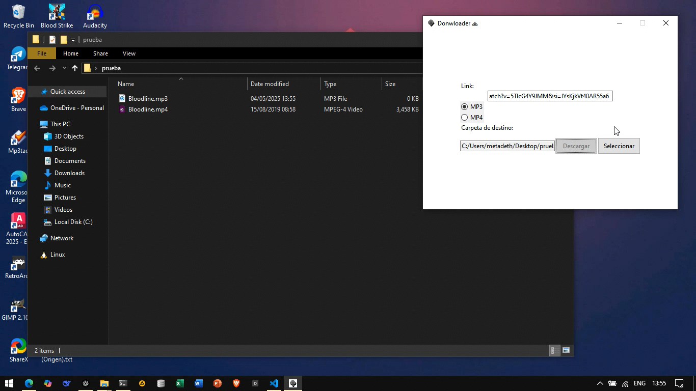

## 📥 Downloader
👉[Download app](https://github.com/VicMosojeda/app_downloader_tk/releases)

# 🎵 Downloader GUI - App to Download MP3 and MP4

Desktop application for Windows that allows you to download MP3 audio or MP4 video from platforms like YouTube, using a user-friendly graphical interface.

## 📦 Features

- ✅ Download **audio (MP3)** or **video (MP4)** from a URL.
- ✅ Simple and intuitive interface.
- ✅ No need to install Python.
- ✅ Lets you choose the destination folder.
- ✅ Supports multiple sites thanks to `yt-dlp`.

## 🖥️ Requirements

- Operating System: **Windows 10/11**
- FFmpeg is included in the executable (if not, make sure it's in your PATH)

## 🚀 How to Use

1. Run the `Downloader.exe` file by double-clicking it.
2. Paste the video or audio link.
3. Choose the format you want:  
   - 🎶 MP3 → audio only  
   - 🎥 MP4 → full video
4. Click **Select folder** to choose where to save the file.
5. Press **Download** and wait for the success message.

## 📁 Included Files

Downloader/
├── Downloader.exe
├── DMownloader.ico
└── README.md

> You can move the folder anywhere, just make sure the `.exe` and the icon file stay together (if you're using it).

## ❗ Important Note

- If you see errors related to FFmpeg, make sure it’s correctly configured or bundled.
- The icon (`DMownloader.ico`) is optional but improves the visual appearance of the program.

## 📜 License

This software is licensed under the MIT License. You are free to use, modify, and distribute it.

---

Thank you for using Downloader! If you have suggestions or issues to report, feel free to contribute or contact me.
